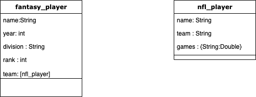

# Fantasy-Football-Archive-API
My friends and I love fantasy football but it is a shame that we find it hard to reminince about our past seasons. This is due to the fact that fantasy football websites such as ESPN and Yahoo do not persist data past a single season. It is understandable as it keeps database costs low but I wanted to create a work around for this. Thus, I had the idea to create an app where my friends could store their past season's data. That way we can have a way to look back into the past. 

This repository contains the backend for the app.

## System Overview

### Basic Class Diagram:

