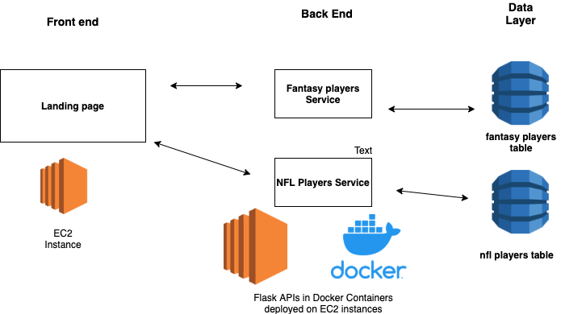

# Fantasy-Football-Archive-API
My friends and I love fantasy football but it is a shame that we find it hard to reminince about our past seasons. This is due to the fact that fantasy football websites such as ESPN and Yahoo do not persist data past a single season. It is understandable as it keeps database costs low but I wanted to create a work around for this. Thus, I had the idea to create an app where my friends could store their past season's data. That way we can have a way to look back into the past. 

This repository contains the backend for the app.

## System Overview

### Basic Class Diagram:

### System Diagram 

Our System will rely on AWS. The landing page will be hosted on an EC2 instance.

As for the backend, I had a choice of whether I would develop the APIs using API Gateway and AWS Lambda or using the Flask framework. I ultimately chose to go with Flask to keep the cloud costs low and to give us the flexibility to move our backend to a free hosting site such as Heroku in the future. The flask apps will be contained in Docker containers to ensure we have all the dependencies we need for deployment.

The data layer will be using DynamoDB. I chose the NoSQL database because it is fast and there are no rules of normalization. No normalization is appealing because we may have missing data. 

### The APIs

There are two APIs contained in this repository, the fantasy_player API and the nfl_player API. Both will be built using Python and the Flask Restful framework. Both APIs will contain basic CRUD operations. There are plans to add a predictive ML model feautre in the future. 
